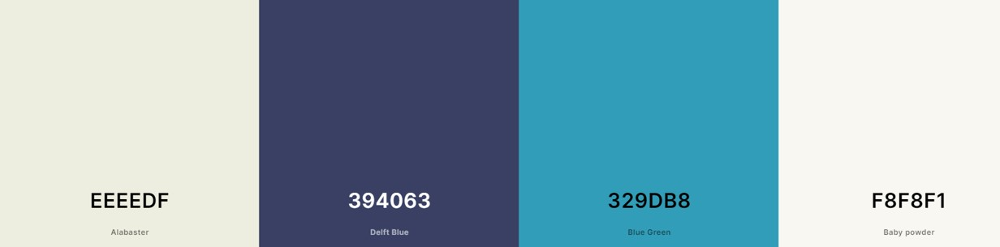
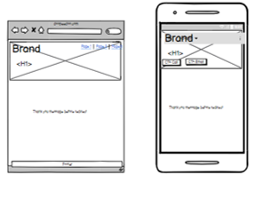
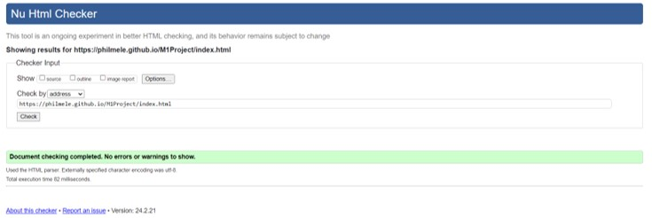
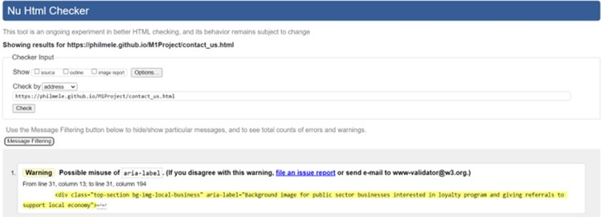
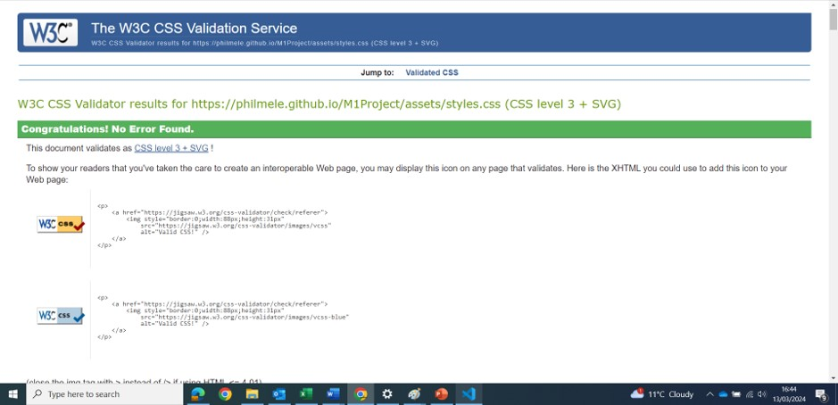
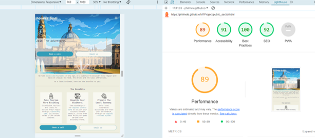

# Code_Institute_P1

Title - Doopee Doo! front end window.

What is Doopee Doo!...?

Doopee Doo! is the Pokemon Go for tourism and Travel. We take users on a quest to discover their region and what makes it unique (food, drinks and local attractions...) and collect rewards along the way. These rewards are collected with a digital loyalty card.

This project is being built as a webapp.

Where does this website come into play? This website is designed to support the commercial aspect of the webapp mentioned above. Whilst the webapp provides a platform to users and businesses to use the digital loyalty card, there is no way for businesses to learn about us and get in touch to acquire new business.

The website covered in this ReadMe will serve as a front end window for potential customers: a sort of first step in the onboarding process to convert a prospect to potential lead by explaining benefits of the product and offering to book a call or message us for more information.

The website is fully responsive and was designed using HTML, CSS and User Centric Design modules.

Although outside the remit of this assessment, some Javascript has been used to customise the boostrap navbar.

View the live site : https://philmele.github.io/M1Project/

# Table of Contents

1. [User Experience](#ux)
   - [Project Goals](#project-goals)
     * [User Goals](#user-goals)
     * [Site Owner Goals](#site-owner-goals)
   - [User Stories](#ux-subsection)
     * [Local Business](#local-business)
     * [Public Sector](#public-sector)
     * [Users](#user)

2. [Design](#ui)
   - [Colours](#colours)
   - [Typography](#typography)
   - [Icons & Images](#icons-images)
   - [Wireframes](#wireframes)

3. [Features](#features)
   - [Capped Max Screen Resolution](#max-screen)
   - [Header](#header)
   - [Navigation Bar](#nav-bar)
   - [Box Section](#box-section)
   - [Footer](#footer)
   - [Carousel](#carousel-page)
   - [Contact Us Form](#contact-us-form)
   - [Book a Call](#calendly-form)
   - [Index Page Row](#index-row)
   - [Call to Action Container](#cta-container)
   - [FAQ](#faq)

4. [Technologies](#tech)

5. [Testing](#testing)
   - [Validator Testing](#val-testing)
     * [HTML](#html)
     * [CSS](#css)
   - [Lighthouse Testing](#lighthouse-testing)
   - [User Testing](#user-testing)

6. [Bugs](#bugs)

7. [Deployment](#deployment)

8. [Credits](#credits)

## 1. User Experience 

### 1.1 Project Goals 

#### 1.1.1 User Goals & Expectations 
Users of this page are threefold: (1)Public Sector representatives such as tourism boards and (2)owners or managers of local independent shops (coffee, food and drinks). (3)A third type of users could be actual users (people) of the digital loyalty card.

Each of this potential users will have different goals, which is why they will be prompted, as the index page to identify the purpose of their visit.

**Public Sector Organisations**: these organisations are varied. Currently we are reciving interest from tourism boards and public transport (Transport for Wales). Their goals browsing through this website will be to understand the benefits of our product and find a way to get in touch.

**Managers and Owners of Local Independent Shops**: Typical customers are independent food, drinks and coffee shops. Just like Public Sector Organisation, the goal of these users will be to understand the benefits of the product and find a way to get in touch with us. However, some of the benefits will be different from Public Sector Organisations, which is why the two will be seperated.

**People (Users)**: these are users of the platform for whom the platform is free to access. Therefore, their goal visiting this website will simply to be redirected to the actual platform.

#### 1.1.2 Site Owner Goals 
As the site owner, our goal is to convert prospects into lead.

As a result, we want the website to provide a clear message of the benefits of the product and an easy way to get in touch with us.

### 1.2 User Stories 

#### 1.2.1 Local Business 
As a local business, I want to learn more about the product and the benefits it could have for my business;
As a local business, I understand the product and benefits and wish to book a call to discuss the next steps and potential onboard my venue
As a local business, I book a business call or send an email to Doopee Doo to discuss the next steps

#### 1.2.2 Public Sector 
As a Public Sector Organisation, I want to learn more about the product and the benefits it could have for my organisation;
As a Public Sector Organisation, I understand the product and benefits and wish to book a call to discuss the next steps and potential onboard my organisation
As a Public Sector Organisation, I book a business call or send an email to Doopee Doo to discuss the next steps

#### 1.2.3 User 
As a User, I landed on this website but was looking to log into the platform instead;
As a User I was re-directed to the platform by clicking on a button;

## 2. Design 

### 2.1 Colours 
The main product is aimed at promoting tourism and travel. We find that Studio Ghibli have delivered some very intersting colour palettes as part of their productions.

As a result, we have used a  colour palette inspired from Studio Ghibli to promote the peace of mind of travelling and yet the excitment. 

### 2.2 Typography 
Typography will follow the theme taken by the colour pallette, uses fonts that remind users of peace of mind and mysterious adventures.

We have selected Google Fonts, instead of custom fonts, to benefit from better support.

The fonts selected are:

For Logo: Permanent Marker

Text: JetBrains

These fonts can be found on: https://fonts.google.com/

### 2.3 Icons & Images 
A selection of icons and images are used for this project.

   #### 2.3.1 Icons 
3 icons are used across 2 pages and can be found in this repo at : `assets\images\icons`.

These icons are used for `local_business.html` and `public_sector.html` to display the 3 benefits of the product to each potential target market (local businesses and public sector entities).

   #### 2.3.2 Imagees 
Images are of 3 sorts:

**First set of images** are used in the index page. These images are used as buttons for the site visitor to identify themselves and what they are looking for. These images can be found at: `assets\images\index`

**Second set of images** are used as background image in the Top Section of the other pages: local_business.html(`assets\images\local_business\main_image`), public_sector.html(`assets\images\public_sector\main_image`), contact_us.html (reusing: `assets\images\local_business\main_image`) and thank_you.html (reusing: `assets\images\local_business\main_image`).

These images exist in 2 versions: under and over 500px.

These two versions are created to adapt to screen width and performance requirements between mobile and desktop version. These images are switched automatically upon reaching a certain screen size width (500px) through media queries which can be found in : `assets\styles.css`

**Third set of images** are the cards displaying current customers identify: name, logo and image of the venue.

All these images have been converted to .webp and compressed to improve performance of site and lighthouse scoring.

### 2.4 Wireframes 
  
  
  
  

## 3. Features 

   ### 3.1 Capped max screen resolution 
   In order to offer a fully responsive website without streched images, the maximum resolution of the <body> tag is capped at 2190px, which is the size of the background images referred in the Navigation Bar section.

   Beyond this size, a `background-color` is applied to <html> tag to extend the background color of the <body> tag.

   ### 3.2 Header 
   The header is made of 3 different sections:
   
   (1) A backround image which is defined through The classes `.bg-img-local-business` or `.bg-img-public-sector`. These classes handle the size of the images depending on screen size through a number of media queries, which can be found at the end of the css file (`assets\styles.css`).
   (2) A customer boostrap navbar which gives site users access to the various pages of the site. We discuss the custom aspect in the next section.
   (3) A blurred square (`.top-image-blurred-square`) that comes on top of `.bg-img-local-business` which contains: a `<h1>`, and a Call to Action section (CtA). The CtA section displays 1 or 2 buttons (depending on screen size) and prompts user to either book a call through a calendly link or leave a message by clicking on button "Email Us" which will redirect the user to `Contact_us.html' that handles the form. This form is discussed futher later on.

   **Note**: An extra `.top-image-blurred-square` was created for `contact_us.html` and `thank_you.html` as the content within the blurred square is slight different and the rendering was not satisfying.

   The header also comes with some styling to garantee navbar and the logo are visible independently of the background image present. To achieve this `.navbar-background-color` is created in the css file applying a dark background. To make sure the transition between the dark background and the background images is made smoothly, `linear-background` is added as the property instead of `background-color`.

   **Note**: the `
` element where `bg-img-local-business` and `bg-img-public sector` is contains an `aria-label="..."`. `Nu Html Checker` will flag it as a warning. Despite the warning we left it as is, as it allows for description of the picture, since the image link is handled in the css file.

   ### 3.3 Navigation Bar 
   In order to achieve the desired design outcome, the blurred square has to disapear when site user click on .navbar-collapse.

   As a result, the navbar has been customised with some javascript.

   This javascript was built by combining many different sources, credited at the bottom of this readme.

   To achieve the following steps need to be taken:
   
   **Step 1-** in div where class `.top-image-blurred-square` is present add id="blurredSquare" to div.

   **Step 2 -** At the bottom of the <body> tag open a Script element 

   **Step 3 -** within this script element create 2 variables:
      `var blurredSquare = document.getElementById('blurredSquare');
      var navbarCollapse = document.querySelector('.navbar-collapse');`
   
   **Step 4 -** in .navbar-toggler add statement onclick="toggleBlurredSquare(). Upon clicking on .navbar-toggler a function can activate.
   
   **Step 5 -** write up functions.
   
   First function:
      This function creates the possibility to hide the element where blurredSquare is present as an ID.

                  

   
   Second function
   This function applies a new property to the css currently applied to `.top-image-blurred-square.hidden`. The function finds the location where function `toggleBlurredSquare` is entered, fetches the relevant css class where id `blurredSquare` is located which is: `.top-image-blurred-square`.
   If this scenario is true and the function will look up for `.top-image-blurred-square` css property with `.hidden` class and applies appointed css:

               

   By the end of this step the code should look at follows:
   
            

   styles.css:

            `/*Hides .top-image-blurred-square when navbar-toggle is clicked */
            .top-image-blurred-square.hidden {
               display: none;
            }`
   
   **Step 6 -** Once the blurred squared is hidden, the navbar can display the menu pages to the user (`class="navbar-collapse collapse show"`). However, if the user decides not to select any pages and simply wants to go back to the page's content before clicking on the navbar the blurred square will remain display:none. The next step is to create a scenario where if the user clicks somewhere that is not a clickable element of the navbar, the `.navbar-collapse` moves from `show` to `hidden`. To achieve this, and `evenListener` needs to be created. 
   This `evenListener` will wait for a defined events to take action. On our case, if something is clicked on the page, that is not related to the navbar, then the navbar will disapear and the blurred squared will be displayed again.

   Start by writing the event listener and define the targeted class through a variable:
   
            
   
   Following this, we can add the scenario that defines what happens if the click element matches the variable by adding the following code:

            

   At the end, the javascript element should look like this:

            

   and css file:

            /*Hides .top-image-blurred-square when navbar-toggle is clicked */
            .top-image-blurred-square.hidden {
               display: none;
            }

   **Missing feature**: would be great to have .navbar-collapse to be switched to `show` if user clicks outside the navbar. However, I could not find a way to achieve this. 

   See [Bugs](#bugs) for credited solution.

   ### 3.4 Box Section 
   Box sections represent content displayed on `local.business.html` and `public_sector.html` as part of the "Benefits" section.

   Box Section displays the 3 main benefits of the product that is specific to the site visitor's need.

   The Box Section leverages Boostrap row and column system.

   However, the rendering of the rows was not satisfactory on some specific screen sizes. As a result `.section-box` is created in the css file.

   This `.section-box` class is set as `display: inline-grid;` by default in the css file and is changed to `display: flow;` through a number of media queries to adapt to screen sizes of a width superior to 768px.

   ### 3.5 Footer 
   The footer contains links to social media and company name.

   The icons used are taken from Font Awesome free section.

   ### 3.6 Carousel 
   A boostrap carousel is used in `local_business.html` and `public_sector.html`.

   It is handled through .our-customer-container which sets the following properties: `display`, `margin`, `justify-content` and `align-items`.

   Addition boostrap classes are such as `data-bs-ride` and `slide`, allowing the carousel to images. `data-bs-ride` is important as without it images would outgrow their container during the "slide" phase to then resize to their desired shape. This is astetically not pleasing and `data-bs-ride` solved this problem.

   **Missing feature**: when going to screen above 768px, the carousel container is no longer set to a width of 100%. As a result, we can see the 6 images being displayed at once during the "slide" transition. I did not find a way to only display 3 at once. 

   ### 3.7 Contact Us Form 
   This form can be reached if a site user clicks on a "Send Email" button.

   Upon clicking, user is redirected to contact_us.html where a form a displayed.

   The form requires the field as mandatory using `required`: first name, last name, email address, identity through a drop down menu (platform user, local business or public sector) and a message.

   `.width-control-form` is used to control the width of fields depending on screen size. 

   Upon submission, user is redirect to `thank_you.html` which confirms the form has been submitted. 

   The following element is added to the top of `thank_you.html` in <head> element: <meta http-equiv="refresh" content="10; url=index.html">.

   This addition redirects the user back to index.html after 10 seconds. To extend or reduce the timeframe `10` can be edited as deemed appropriate. Url can also be changed for to another page.

   **Note**: `.width-control-form` is used in the form fields instead of the form element. For some reason, having `.width-control-form` in the <form> element or any 
 above seem to center the field to the left, and not the center of the screen. The solution is not elegant, as the class is repeated but this is the solution we found to the "centering" problem.

   Please note the used of `.hide-button` in the "Email us" buttons in the Box Section area (`local_business.html` and `public_sector.html`). This class turns display to `None` when the screen reaches a 768px. This is handled through a media query.

   The reason for this is because at 768px, the 3 boostrap columns cease to stack on top of each other and display aligned in the same row.

   Leaving the design as is, there would be a "Email us" repeated 3 times across the row.

   To make this more aestheticly pleasing, these buttons are hidden at 768px and a single "Email us" button is displayed under the row. This is discussed further [here](#cta-container).

   **Note**: As we prefer to invite people to pro-actively book calls instead of sending emails, the "Email us" form is less available. In screen size lower than 768px, only the "Book a call" button is available in "The Benefits" area.

   ### 3.8 Book a Call - Calendly Form 
   As a part of the call to actions (CTA), we prefer to call booking system through the "Book a Call" button.

   As a result, we add a link in the button that redirects the user to calendly. Upon clickling on the button, users are redirected to our calendly calender (linked with our outlook calendar) for them book slots for discovery calls.

   Please note the used of `.hide-button` in the "Book a Call" buttons in the Box Section area (`local_business.html` and `public_sector.html`). This class turns display to `None` when the screen reaches a 768px.This is handled through a media query.

   The reason for this is because at 768px the 3 boostrap columns seize to stack on top of each other and display aligned in the same row.

   Leaving the design as is, there would be a "Book a Call" repeated 3 times across the row.

   To make this more astheticly pleasing, these buttons are hidden at 768px and a single "Book a Call" button is displayed under the row. This is discussed further in [here](#cta-container).

   ### 3.9 Index Page Row 
   The index page is slightly different than the other pages.

   The objective of this page is to give three very simple choices to the visitor: are they a user? a local business?.. or do they represent the public sector?

   Each of these choices redirect the user to a specific link that is relevant to who they are and what they are looking for.

   To keep the choice simple, the amount of images is also reduced.

   The navbar entails a specific class `.navbar-background-color-index`, setting the background color to the same color as the rest of the <body>.

   Also, the three choices are displayed in a Boostrap 5 row and column setting: user link is presented in the first row and the links to local businesses and public sector pages are displayed in the second row.

   By using boostrap rows and columns, the idea is to have the rows displayed at full lenght until the screen resolution doesn't allow it anymore, after which all rows and columns stack on top of each other.

   **Consideration for responsivness for the boostrap rows**: In addition `.row` is also overwritten in the css file to to display as `grid` as a media query. This is done through `row-index`.

   It is important to not give the `grid` attribute to the `.row`: this will create an error in the display at 678px for other pages (`local_business.html` and public_sector.html`).
   
   Failing this, when reaching 387px the two columns within the second row would start aligning next to each other instead of stacking up. This media query fixes this problem.
   
   **Consideration for responsivness images**: To make the images responsive, and allow them to reduce when the screen size is less than the width of the images, class `.index-main-audience` regulates the size of the images for screen between 320 and 387px in a media query.

   ### 3.10 Call to Action Container 
   Below the box section `
` is used to create a special container.

   This container only appears when screen size is above 768px and is facilited through `.hide-container` handled in the css file.

   The reason for this container to exist, is to avoid duplication of the buttons when the 3 columns in the Box Section are displayed on the same row.

   `.hide-container` is handled through a media query.
   
   ### 3.11 FAQ 
   A Frequently Asked Question (FAQ) section is displayed at the bottom of `local_business.html` and `public_sector.html`.

   Each question is presented through collapsible panel.

   Leveraging Boostrap 5, the use of `d-flex justify-content-center align-items-center flex-column` centers the content of the div in the middle of the screen.

   Use `width-control` to control the width of each panel depending on the screen with. This is handled through media queries.

## 4. Technologies 

**HTML** - The main language use through is website is HTML.

**CSS** - CSS is the second most used language and is instrumental in styling and controlling screen width scenarios.

**Bootstrap** - The Bootstrap framework is used throughout this website for layouts and styling. 

**Javascript** - Javascript has been used on a single occasion to customise the boostrap navbar.

**Font Awesome** - Font awesome Icons are used for the social icons displayed in the footer and the navbar's "burger menu" in mobile view.

**Google Fonts** - Google fonts are used to render the fonts.

**Visual Studio Code** - VS Code is the Integrated Development Environment used to develop the Website.

**GitHub** - GithHub is the hosting site used to store the source code for the Website and Git Pages is used for the deployment of the live site.

**Git** - Git is used as version control software to commit and push code to the GitHub repository where the source code is stored.

**Convertio** - Used to convert .jpeg into webp images.

**TinyJPG** - Used to compress webp images to increase the performance of the site.

**Google Chrome Developer Tools** - Used to debug front end.

**Balsamiq Wireframes** - Used to create wireframes.

**Pixso** - Used to design wireframes.

**Stable Diffusion** - Used to images against prompt in Studio Ghibli Style.

**Imageenhan** - Used to generate Img2img Studio Ghibli Style.

**ui.dev** - Used to generate first image in Readme file rendering site in different format.

**notion.so** - Used to generate tables for Readme file.

**ChatGPT** - Used to find solution listed in [Bugs](#bugs). Note this solution is not in the code.

## 5. Testing 

   ### 5.1 Validator Testing 

   #### 5.1.1 HTML 
   

      
index.html

      

         
      

   

   
   

      
local_business.html

      

         
      

      

         <b>Note:</b> the `div` element where <code>bg-img-local-business</code> and <code>bg-img-public sector</code> contains an <code>aria-label="..."</code>. <code>Nu Html Checker</code> will flag it as a warning. Despite the warning, we left it as is, as it allows for a description of the picture, since the image link is handled in the CSS file.
      

   

   

      
public_sector.html

      

         
      

      

         <b>Note:</b> the `div` element where <code>bg-img-local-business</code> and <code>bg-img-public sector</code> contains an <code>aria-label="..."</code>. <code>Nu Html Checker</code> will flag it as a warning. Despite the warning, we left it as is, as it allows for a description of the picture, since the image link is handled in the CSS file.
      

   

   

      
contact_us.html

      

         
      

      

         <b>Note:</b> the `div` element where <code>bg-img-local-business</code> and <code>bg-img-public sector</code> contains an <code>aria-label="..."</code>. <code>Nu Html Checker</code> will flag it as a warning. Despite the warning, we left it as is, as it allows for a description of the picture, since the image link is handled in the CSS file.
      

   

   

      
thank_you.html

      

         
      

      

         <b>Note:</b> the `div` element where <code>bg-img-local-business</code> and <code>bg-img-public sector</code> contains an <code>aria-label="..."</code>. <code>Nu Html Checker</code> will flag it as a warning. Despite the warning, we left it as is, as it allows for a description of the picture, since the image link is handled in the CSS file.
      

   

   #### 5.1.2 CSS 
   

      
CSS Testing

      

         
      

   

   ### 5.2 Lighthouse Testing 
   **INDEX**
   

      
INDEX

      

         <h3>Mobile</h3>
         
      

      

         <h3>Desktop</h3>
         
      

   

   

      
LOCAL BUSINESS

      

         <h3>Mobile</h3>
         
      

      

         <h3>Desktop</h3>
         
      

   

   

      
PUBLIC SECTOR

      

         <h3>Mobile</h3>
         
      

      

         <h3>Desktop</h3>
         
      

   

   

      
CONTACT US

      

         <h3>Mobile</h3>
         
      

      

         <h3>Desktop</h3>
         
      

   

   

      
CONTACT US

      

         <h3>Mobile</h3>
         
      

      

         <h3>Desktop</h3>
         
      

   

   ### 5.3 User Testing 
   
| Item | Description | Steps | Expected Result | Actual Result | Pass/Fail | Comment |
| --- | --- | --- | --- | --- | --- | --- |
| 1 | Test brand link on Index Page | Click on Doopee Doo! on top left of screen | User is redirected to index page | User is redirected to index page | Pass |  |
| 2 | Test links on navbar on Index Page | Click on navbar toggle, or directly on link if screen width allows | User is redirect to the right pages | User is redirect to the right pages | Pass |  |
| 3 | Test user link on Index Page | Click on user image. | A new page is open redirecting the user to the platform | A new page is open redirecting the user to the platform | Pass |  |
| 4 | Test local shop link on Index Page | Click on local shop image. | User is redirect to local_business.html | User is redirect to local_business.html | Pass |  |
| 5 | Test public sector link on Index Page | Click on pulic sector image. | User is redirect to public_sector.html | User is redirect to public_sector.html | Pass |  |
| 6 | Test social links on Index Page | Click on social icons | A new page is open redirecting the user to the relevant social platform | A new page is open redirecting the user to the relevant social platform | Pass |  |
| 7 | Test brand link on Local Business Page | Click on Doopee Doo! on top left of screen | User is redirected to index page | User is redirected to index page | Pass |  |
| 8 | Test links on navbar on Local Business Page | Click on navbar toggle, or directly on link if screen width allows | User is redirect to the right pages | User is redirect to the right pages | Pass |  |
| 9 | Test social links on Local Business Page | Click on social icons | A new page is open redirecting the user to the relevant social platform | A new page is open redirecting the user to the relevant social platform | Pass |  |
| 10 | Test book a call on Local Business Page | Click on book a call | User is rediected to Calendly to select time slot on another page | User is rediected to Calendly to select time slot on another page | Pass |  |
| 11 | Test Email us on Local Business Page | Click on Email Us | User is redirected to contact_us.html | User is redirected to contact_us.html | Pass |  |
| 12 | Test Carousel Local Business Page | Click on arrows on right and left side of carousel | a deck of 3 other images is displayed to the user, whilst the initial 3 cards slide to the left. | a deck of 3 other images is displayed to the user, whilst the initial 3 cards slide to the left. | Pass |  |
| 13 | Test FAQ Local Business Page | Click on question | Answers to the questions is displayed to user in a collapsible panel | Answers to the questions is displayed to user in a collapsible panel | Pass |  |
| 14 | Test brand link on Public Sector Page | Click on Doopee Doo! on top left of screen | User is redirected to index page | User is redirected to index page | Pass |  |
| 15 | Test links on navbar on Public Sector Page | Click on navbar toggle, or directly on link if screen width allows | User is redirect to the right pages | User is redirect to the right pages | Pass |  |
| 16 | Test social links on Public Sector Page | Click on social icons | A new page is open redirecting the user to the relevant social platform | A new page is open redirecting the user to the relevant social platform | Pass |  |
| 17 | Test book a call on Public Sector Page | Click on book a call | User is rediected to Calendly to select time slot on another page | User is rediected to Calendly to select time slot on another page | Pass |  |
| 18 | Test Email us on Public Sector Page | Click on Email Us | User is redirected to contact_us.html | User is redirected to contact_us.html | Pass |  |
| 19 | Test Carousel Public Sector Page | Click on arrows on right and left side of carousel | a deck of 3 other images is displayed to the user, whilst the initial 3 cards slide to the left. | a deck of 3 other images is displayed to the user, whilst the initial 3 cards slide to the left. | Pass |  |
| 20 | Test FAQ Public Sector Page | Click on question | Answers to the questions is displayed to user in a collapsible panel | Answers to the questions is displayed to user in a collapsible panel | Pass |  |
| 21 | Test brand link on Contact Us Form | Click on Doopee Doo! on top left of screen | User is redirected to index page | User is redirected to index page | Pass |  |
| 22 | Test links on navbar on Contact Us Form | Click on navbar toggle, or directly on link if screen width allows | User is redirect to the right pages | User is redirect to the right pages | Pass |  |
| 23 | Test social links on Contact Us Form | Click on social icons | A new page is open redirecting the user to the relevant social platform | A new page is open redirecting the user to the relevant social platform | Pass |  |
| 24 | Test Form | Populate form. Without missing fields and with all fields | If some fields are not populated the form returns a message requesting the user to populate missing field. If all field completed, user is redirected to thank_html. | If some fields are not populated the form returns a message requesting the user to populate missing field. If all field completed, user is redirected to thank_html. | Pass |  |
| 25 | Test brand link on Thank You Page | Click on Doopee Doo! on top left of screen | User is redirected to index page | User is redirected to index page | Pass |  |
| 26 | Test links on navbar on Thank You Page | Click on navbar toggle, or directly on link if screen width allows | User is redirect to the right pages | User is redirect to the right pages | Pass |  |
| 27 | Test social links on Thank You Page | Click on social icons | A new page is open redirecting the user to the relevant social platform | A new page is open redirecting the user to the relevant social platform | Pass |  |
| 28 | Test Book a Call on Thank You Page | Click on book a call | User is rediected to Calendly to select time slot on another page | User is rediected to Calendly to select time slot on another page | Pass | Initially failed. The button had the hide-button class, which turned its display to “none” after a certain screen size. |
| 29 | Test Redirection button on Thank You Page | Click on link “home page” | User is redirected to index.html when click | User is redirected to index.html when click | Pass |  |
| 30 | Test Javascript of Navbar for Index | Click on toggle in navbar | When user click on toggle pf navbar blurred square disapear and only repears when toggle is clicked again | When user click on toggle pf navbar blurred square disapear and only repears when toggle is clicked again | Pass |  |
| 31 | Test Javascript of Navbar for Local Business | Click on toggle in navbar | When user click on toggle pf navbar blurred square disapear and only repears when toggle is clicked again | When user click on toggle pf navbar blurred square disapear and only repears when toggle is clicked again | Pass |  |
| 32 | Test Javascript of Navbar for Public Sector | Click on toggle in navbar | When user click on toggle pf navbar blurred square disapear and only repears when toggle is clicked again | When user click on toggle pf navbar blurred square disapear and only repears when toggle is clicked again | Pass |  |
| 33 | Test Javascript of Navbar for Contact_us | Click on toggle in navbar | When user click on toggle pf navbar blurred square disapear and only repears when toggle is clicked again | When user click on toggle pf navbar blurred square disapear and only repears when toggle is clicked again | Pass | Initially failed as javascript wasnt on the page. |
| 34 | Test Javascript of Navbar for Thank_you | Click on toggle in navbar | When user click on toggle pf navbar blurred square disapear and only repears when toggle is clicked again | When user click on toggle pf navbar blurred square disapear and only repears when toggle is clicked again | Pass |  |
| 35 | Index Page stacks up rows and columns until screen size >992px | Tailor screen width under 992px | When <992px all columns are stacked up | When <992px all columns are stacked up | Pass |  |
| 36 | Index Page displays full rows width for screen size  <992px | Tailor screen width over 992px | When ≥992px 2 rows are displayed. | When ≥992px 2 rows are displayed. | Pass |  |
| 37 | Local Business Page - CTA buttons showing within blurred square at all breakpoints | Test screen width at all breaking points | Buttons remain within blurred square area at all time | Buttons remain within blurred square area at all time | Pass |  |
| 38 | Local Business Page - columns stack up until 768px is reached then show in a single row. | Test render at 767px, 768px and 769px | Until 768px screen width columns are stacked up on top of each other. Then displayed in a single row from 768px. | Until 768px screen width columns are stacked up on top of each other. Then displayed in a single row from 768px. | Pass |  |
| 39 | Depending on screen width: if columns are stacked up onlshow “Book a call” button at bottom of column. If columns are on a single row dispplay both “Book a Call” and “Email us” buttons.  | Expand and reduce screen size from 320px to 2000px. | When screen size is under 768px “book a call” button appears at bottom of each column. From 768px Book a  Call and Email Us buttons appear at bottom of row | When screen size is under 768px “book a call” button appears at bottom of each column. From 768px Book a  Call and Email Us buttons appear at bottom of row | Pass |  |
| 40 | Local Business Page - carousel follws width-control from 991px screen size. | Test rendering at 990px, 991px and 992px. | Carousel remains within width set by class | Carousel remains within width set by class | Pass |  |
| 41 | Local Business Page - FAQ follws width-control from 991px screen size. | Test rendering at 990px, 991px and 992px. | FAQ remains within width set by class | FAQ remains within width set by class | Pass |  |
| 42 | Public Sector - CTA buttons showing within blurred square at all breakpoints | Test screen width at all breaking points | Buttons remain within blurred square area at all time | Buttons remain within blurred square area at all time | Pass |  |
| 43 | Public Sector - columns stack up until 768px is reached then show in a single row. | Test render at 767px, 768px and 769px | Until 768px screen width columns are stacked up on top of each other. Then displayed in a single row from 768px. | Until 768px screen width columns are stacked up on top of each other. Then displayed in a single row from 768px. | Pass |  |
| 44 | Public Sector -Depending on screen width: if columns are stacked up onlshow “Book a call” button at bottom of column. If columns are on a single row dispplay both “Book a Call” and “Email us” buttons.  | Expand and reduce screen size from 320px to 2000px. | When screen size is under 768px “book a call” button appears at bottom of each column. From 768px Book a  Call and Email Us buttons appear at bottom of row | When screen size is under 768px “book a call” button appears at bottom of each column. From 768px Book a  Call and Email Us buttons appear at bottom of row | Pass |  |
| 45 | Public Sector Page - carousel follws width-control from 991px screen size. | Test rendering at 990px, 991px and 992px. | Carousel remains within width set by class | Carousel remains within width set by class | Pass |  |
| 46 | Public Sector Page - FAQ follws width-control from 991px screen size. | Test rendering at 990px, 991px and 992px. | FAQ remains within width set by class | FAQ remains within width set by class | Pass |  |
| 47 | Contact us page is responsive | Expand screen width from 320px to 2000px | No buttons or images are disapearing. Blurred square and content is sized appropriately. | No buttons or images are disapearing. Blurred square and content is sized appropriately. | Pass |  |
| 48 | Thank You page is responsive | Expand screen width from 320px to 2000px | No buttons or images are disapearing. Blurred square and content is sized appropriately. | No buttons or images are disapearing. Blurred square and content is sized appropriately. | Pass |  |

## 6. Bugs & Considerations for the future 

Wide screen rendering - we had a once off opportunity to test the site on a 4K gaming screen and showed the buttons coming stlightly out of the blurred square. I have been unable to reproduce this rendering since.

`.contact-us-row` contains an `!Important` as I couldn't find a way to set `display: flex` without it.

There is a few redundancy, or at least areas where the code could be made more efficent: `.top-image-blurred-square` and `.top-image-blurred-square-form`: I feel I could have done better here and probably merge both classes, as they look a bit redundant. I only thought of using `fit-content` attribute for the blurred squared. Eventhough it has been in front of me the whole time.

I made too many commit for the Readme file, mostly because I didnt know how to render it without pushing each iterations to github. I only found about `notion.so` at the end of the project, which I used for the tables. Will be using it moving forward from the begining.

**Navbar + solution**
The <script> that triggers that customised navbar returns an error in the developer tool: `Uncaught TypeError: event.target is not a function
    at HTMLDocument.<anonymous>`.

This error does not seem to cause any problem in the functionality of the website.

An another disapointment of this project is that I also did not manage to find a solution to get the customised navbar to close by itself when the user clicks outside the navbar panel.

**Custom Navbar - The Fix**

This solution was delivered using ChatGPT and is not in the code. 

My initial plan was to implement this fix in the code and obviously credit the source. After conversation with Code Institute they advised to not put the code provided by ChatGPT in the template for the purpose of the assessement. 

As a result, and for the sake completness, I thoughth I would add the finalised code in this section, together with my understanding of it.

This is the finalised missing code:

      var isNavbarToggler = event.target.closest('.navbar-toggler');
      var isNavbarCollapse = event.target.closest('.navbar-collapse');

The addition is the use of `closest()`.

According W3School (https://www.w3schools.com/jsref/met_element_closest.asp), `closest()` is a method that looks up for a CSS selector from the element itself all the way up to the parent elements the child element could have.

In this case, looks up for parent element linked to either `.navbar-toggler` or `.navbar-collapse`. If this look up returns `null` (the user did not click on the toggle, or an element in the navbar collapsible panel) then `.navbar-collapse` is not rendered.

I also not that my error : `Uncaught TypeError: event.target is not a function at HTMLDocument.<anonymous>` has also disapeared from the browser console.

## 7. Deployment 

**Project Creation**
The project starts started by creating a folder from VS Code name `M1Project`. 

Once the folder is created, click on folder to start from sratch.

**Local Deployment**
To copy this project, you can use git clone from your terminal.

Go to the terminal and input: `git clone https://github.com/PhilMele/M1Project.git` in the directory you wish to have the project folder in.

Using your code editor, such as VS Code, click on `open folder` and click on the newly created folder.

## 8. Credits 

**Boostrap navbar**: https://getbootstrap.com/docs/5.3/components/navbar/

**Making boostrap cards same color across all columns** : https://stackoverflow.com/questions/35868756/how-to-make-bootstrap-cards-the-same-height-in-card-columns

**Carousel section** : https://stackoverflow.com/questions/75345639/bootstrap-5-multiple-cards-in-carousel

**Linear Gradient** - https://www.w3schools.com/css/tryit.asp?filename=trycss3_gradient-linear

**FAQ Section** : https://getbootstrap.com/docs/5.0/components/collapse/

**Blurred background** : https://dev.to/schleidens/how-to-use-blur-background-header-image-with-text-mask-a6a 

**Cropping images** : https://stackoverflow.com/questions/26218954/crop-image-in-css

**Fixed issue with background image not loading** : https://stackoverflow.com/questions/21374534/css-background-image-not-loading

**Javascript** : These are the main sources used.

This initial link showed me the basic principles but I needed more to keep my background transparent : https://www.w3schools.com/howto/howto_js_toggle_hide_show.asp

This code put me in the direction of creating a .hidden class in css: https://stackoverflow.com/questions/41213737/how-to-make-text-appear-and-disappear-when-a-div-is-clicked-on

This link suggested to use event listener + removing event after clicking outside of element : https://stackoverflow.com/questions/73764793/toggle-menu-if-click-outside-then-hide

**ui.dev** : renders responsivness in different formats:  https://ui.dev/amiresponsive

**Collapsible menu in Readme** - https://gist.github.com/pierrejoubert73/902cc94d79424356a8d20be2b382e1ab

Stack Overflow community for general answers regarding `Boostrap` classes and `Javascript`.

Gareth Mc Girr who guided me through this project, in particular to increase performance of the pages on mobile view by using WEBP formats.

Images were taken from the businesses' offical websites and newspaper (Visit Caerphilly, Cadw, Transport for Wales, Tramshed Tech..).

The processes of the images into "anime like" pictures is done through `Stable Diffusion` and `Imageehan` - a big thank you to Sonic who runs Imageehan. It's a great product.

The Cards' frame template displayed in the carousels were commissioned from a UX/UI designer for the purpose of the project this website is supporting.

